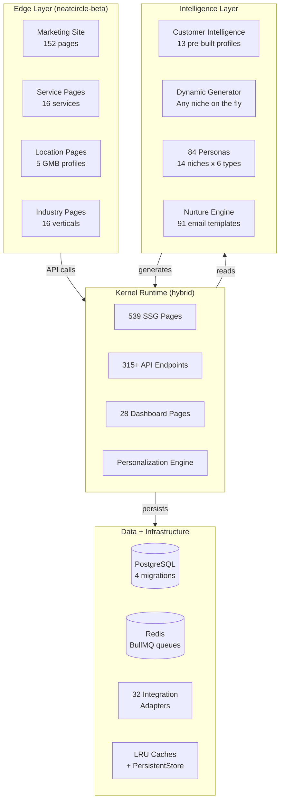
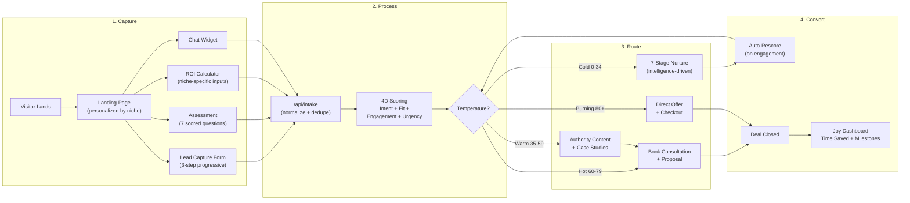
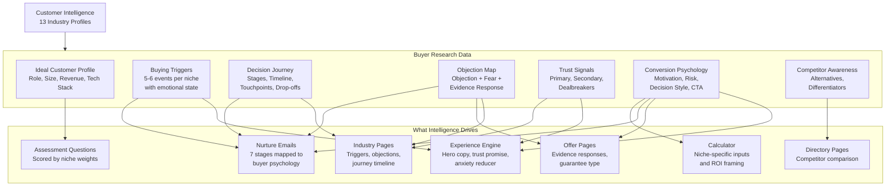
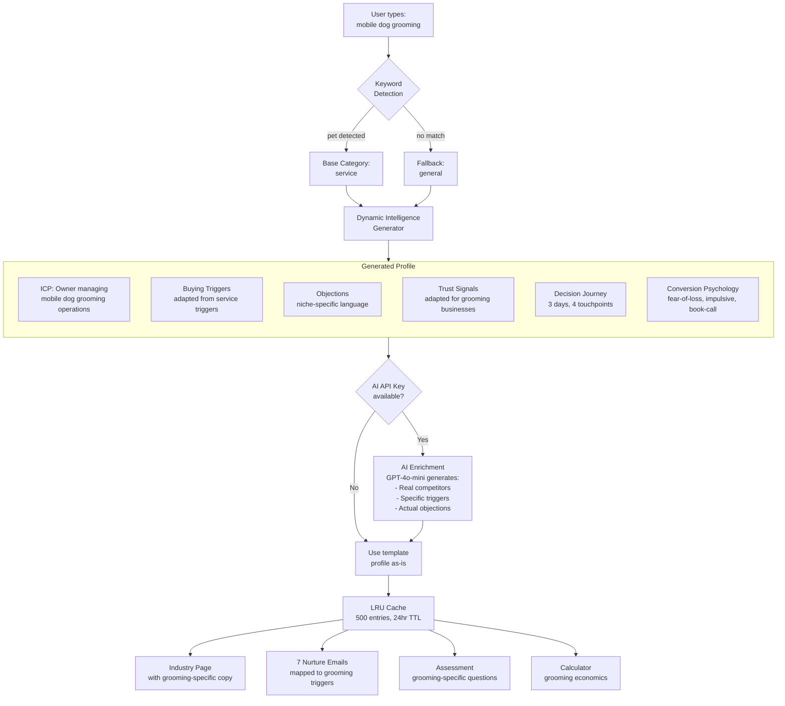
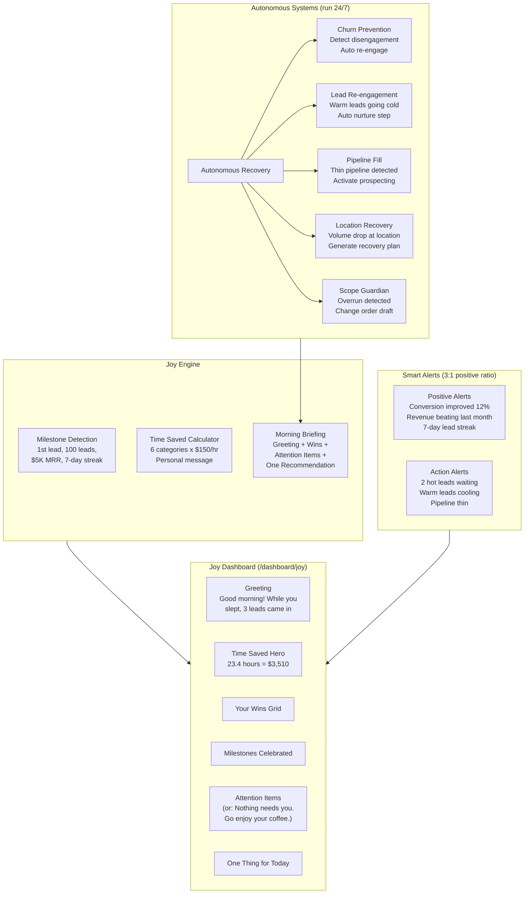
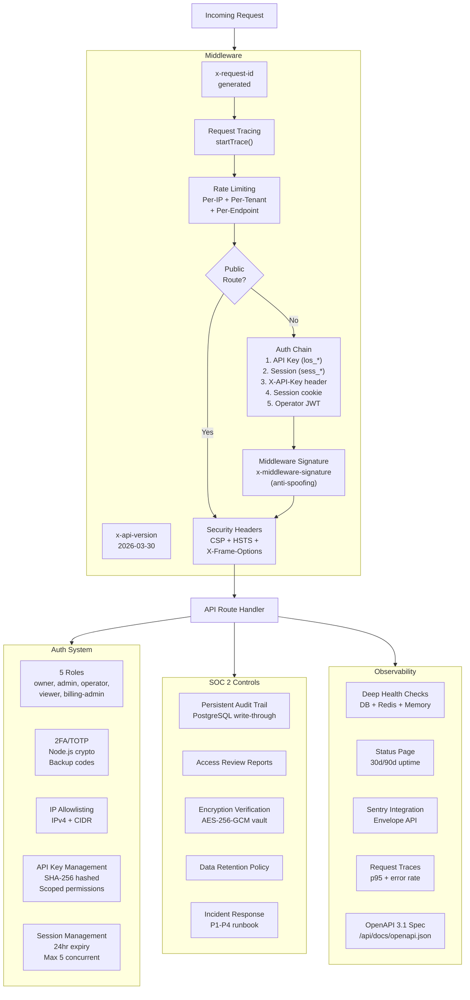

# LeadOS System Diagrams

Visual documentation of every major system in LeadOS. Each diagram is interactive — click the edit link to modify it in the Mermaid Live Editor.

---

## 1. System Architecture — 4-Layer Model

Shows how the Edge Layer, Kernel Runtime, Intelligence Layer, and Data Infrastructure connect.

[Edit this diagram](https://l.mermaid.ai/Uojo3m)

---

## 2. Lead Pipeline Flow — Capture to Conversion

The complete journey from visitor landing to deal closed, showing 4D scoring, temperature routing, and the nurture feedback loop.

[Edit this diagram](https://l.mermaid.ai/Qs0zC8)

---

## 3. Customer Intelligence Engine — Research to Every Surface

How deep buyer research (buying triggers, objections, trust signals, conversion psychology, competitor awareness) flows into every customer-facing component.

[Edit this diagram](https://l.mermaid.ai/3U4PBM)

---

## 4. Dynamic Niche Generation — Any Keyword to Complete System

How typing any niche keyword (like "mobile dog grooming") generates a full intelligence profile, nurture sequence, and web presence.

[Edit this diagram](https://l.mermaid.ai/H7OCiG)

---

## 5. Joy Layer — Autonomous Systems That Work While You Sleep

The Joy Engine, Autonomous Recovery, Smart Alerts, and the Joy Dashboard that gives users their time back.

[Edit this diagram](https://l.mermaid.ai/n3wKo2)

---

## 6. Enterprise Security Architecture

The complete auth chain, SOC 2 controls, and observability stack.

[Edit this diagram](https://l.mermaid.ai/pxzbkC)
