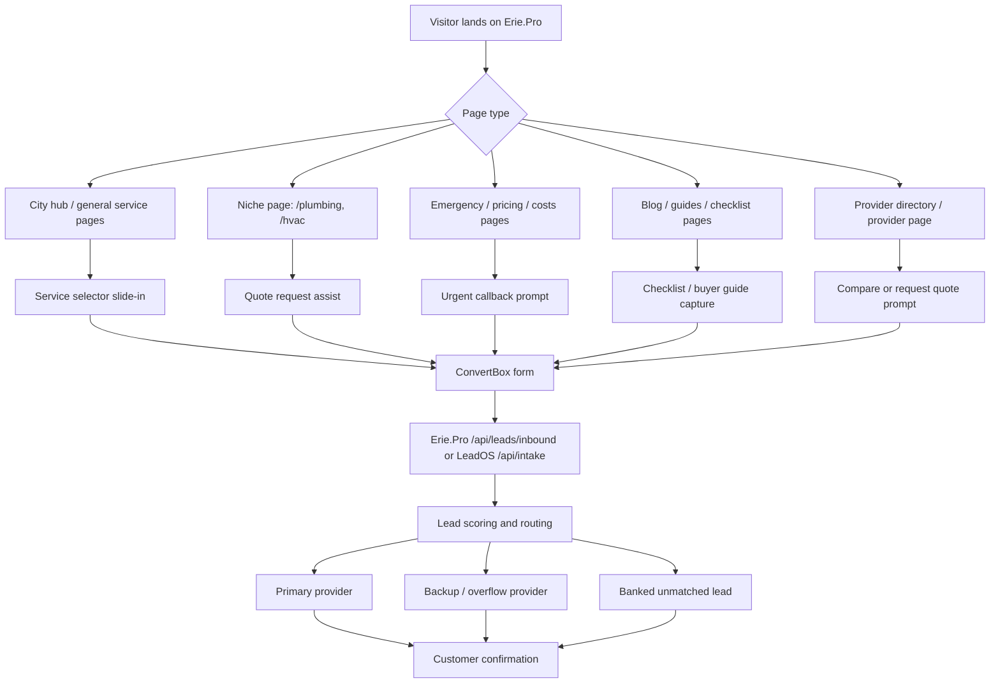
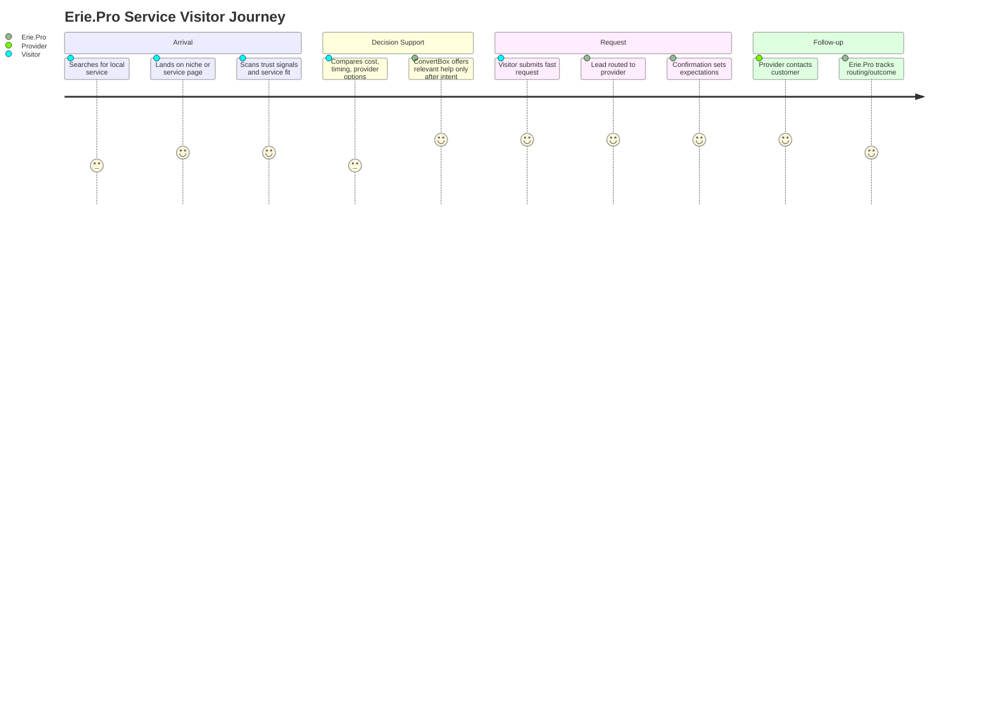
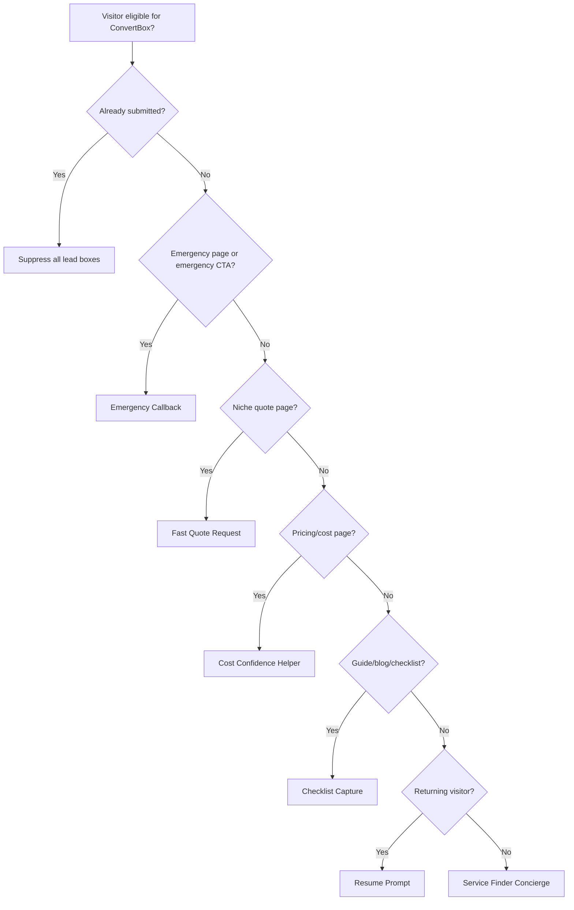

# Erie.Pro ConvertBox Experience Plan

Date: 2026-05-10

Goal: use ConvertBox as a polite, high-converting concierge layer on Erie.Pro. It should help visitors get the right local service quickly without making the site feel pushy, noisy, or confusing.

## Service Scope Note

As of the latest fetched GitHub refs checked on 2026-05-10, Erie.Pro's repo catalog has 44 core top-level service categories in `erie-pro/src/lib/niches.ts`. The live site at `https://www.erie.pro`, however, currently presents 112 service options in the public request form. Those 112 live services are the ConvertBox planning source of truth unless the deployed site changes again. Each service also expands into common services, emergency services, pricing ranges, seasonal intents, glossary intents, provider-listed services, and visitor problem states. Practically, ConvertBox should be designed for hundreds of service/subservice journeys, not 44 generic forms.

## Core Principle

Erie.Pro already has the authority pages, niche pages, provider directory, lead routing, and dashboard. ConvertBox should not replace those pages. It should appear only when it can do one of four helpful things:

1. Reduce uncertainty.
2. Speed up a service request.
3. Rescue a visitor who is about to leave.
4. Personalize the next step based on what the visitor needs.

## Visitor Psychology

Most Erie.Pro visitors are not browsing casually. They usually arrive with one of these mindsets:

| Visitor State | What They Feel | What They Need | ConvertBox Role |
|---|---|---|---|
| Emergency | Stress, urgency, low patience | Fast contact, reassurance, minimal fields | Direct request/callback overlay |
| Shopping | Uncertainty, price concern | Compare options, understand cost, avoid bad provider | Guide to quote request |
| Researching | Cautious, low trust | Education, checklist, confidence | Soft lead magnet or service selector |
| Returning | Already considering action | Easy continuation | Resume/request reminder |
| Provider | Wants leads/territory | Proof, claim path, business upside | Provider claim prompt |

## Experience Rules

- Never show more than one ConvertBox per session unless the visitor interacts.
- Never show a box immediately on page load except for direct click-triggered forms.
- Never interrupt a form page if the built-in form is already visible.
- Use small slide-ins for helpful prompts, modals only for high-intent actions.
- Suppress boxes for 7-14 days after submission.
- Mobile should be lighter than desktop: bottom bar or small slide-in, not full-screen unless clicked.
- All primary boxes should feel like Erie.Pro helping, not advertising.

## System Map



## Journey Map



## ConvertBox Campaigns

### 1. Service Finder Concierge

Purpose: help unsure visitors choose the right category.

Where:
- Erie.Pro homepage
- `/services`
- city hub pages
- broad directory pages

Trigger:
- 35-45 seconds on page
- or 50% scroll
- or click on "Find a Pro" CTA

Format:
- Small slide-in on desktop
- Bottom bar on mobile

Copy:
- Headline: "Need help finding the right Erie pro?"
- Body: "Tell us what you need and we’ll point you to the right local service path."
- CTA: "Find My Service"

Fields:
- Service needed
- Zip or neighborhood
- Timeline

Next step:
- If plumbing/HVAC: send to the relevant niche request box.
- If unsupported category: capture as general request or route to concierge.

### 2. Fast Quote Request

Purpose: capture high-intent visitors on niche pages.

Where:
- `/plumbing`
- `/hvac`
- future niche main pages
- directory pages
- provider pages

Trigger:
- 45 seconds on page
- 60% scroll
- second pageview in same niche
- exit intent
- direct CTA click

Format:
- Center modal only on CTA click or exit intent.
- Slide-in for passive triggers.

Copy:
- Headline: "Want a fast Erie plumbing quote?"
- Body: "Share a few details and we’ll route your request to the right local provider."
- CTA: "Request My Quote"

Fields:
- Name
- Email
- Phone
- Service category
- Timeline
- Short message
- Consent checkbox

Metadata:
- `source=convertbox`
- `niche=plumbing` or current niche
- `city=Erie`
- `intent=quote`
- `page_type=niche`

### 3. Emergency Callback

Purpose: serve urgent visitors without making them hunt.

Where:
- `/plumbing/emergency`
- `/hvac/emergency`
- emergency-related articles
- pricing/cost pages with urgent keywords

Trigger:
- Immediate only if user clicks emergency CTA.
- 20-30 seconds on emergency page.
- exit intent on emergency page.

Format:
- Compact modal or slide-in.

Copy:
- Headline: "Need urgent help in Erie?"
- Body: "Send your request now so a local provider can contact you as quickly as possible."
- CTA: "Request Urgent Callback"

Fields:
- Name
- Phone required
- Email
- Emergency type
- Location/neighborhood
- Short message

Metadata:
- `intent=emergency`
- `urgency=high`
- `preferred_contact=phone`
- `temperature=hot`

UX note:
- This box must be the shortest. In emergencies, every extra field feels expensive.

### 4. Cost Confidence Helper

Purpose: convert visitors reading pricing/cost pages.

Where:
- `/plumbing/pricing`
- `/plumbing/costs`
- `/hvac/pricing`
- `/hvac/costs`

Trigger:
- 50% scroll
- 60+ seconds on page
- return visitor

Format:
- Slide-in.

Copy:
- Headline: "Want a realistic local price range?"
- Body: "Tell us the issue and we’ll help you request a quote with the right details."
- CTA: "Get Price Guidance"

Fields:
- Service issue
- Home/business
- Timeline
- Zip
- Email or phone

Best use:
- This should bridge education to quote, not promise exact pricing.

### 5. Checklist Capture

Purpose: capture research-stage visitors without forcing a quote.

Where:
- `/plumbing/checklist`
- guides
- blog posts
- seasonal pages
- certification pages

Trigger:
- 65% scroll
- 90+ seconds on page
- exit intent

Format:
- Slide-in or embedded ConvertBox.

Copy:
- Headline: "Want the Erie hiring checklist?"
- Body: "Use it to ask better questions before choosing a provider."
- CTA: "Send Me the Checklist"

Fields:
- Email
- Service category
- Optional timeline

Metadata:
- `intent=education`
- `temperature=warm`
- `preferredFamily=lead-magnet`

Follow-up:
- Send checklist.
- One soft follow-up: "Still need help finding a provider?"

### 6. Returning Visitor Resume Prompt

Purpose: help visitors who came back but did not submit.

Where:
- All consumer service pages.

Trigger:
- Returning visitor
- 2+ service pages viewed
- no prior submission

Format:
- Small slide-in.

Copy:
- Headline: "Still looking for the right Erie pro?"
- Body: "You can send one request and let Erie.Pro route it for you."
- CTA: "Finish My Request"

Fields:
- Preselect niche based on browsing behavior.
- Ask only for missing contact and timeline details.

### 7. Provider Territory Claim Prompt

Purpose: convert local businesses, not consumers.

Where:
- `/for-business`
- `/pros`
- provider dashboard marketing pages
- unclaimed provider listing pages
- directory pages when visitor appears business-side

Trigger:
- CTA click
- 60 seconds on provider-oriented page
- exit intent

Format:
- Modal on click, slide-in on exit.

Copy:
- Headline: "Want the Erie [niche] territory?"
- Body: "Claim your listing and learn how exclusive lead routing works."
- CTA: "Check Territory Availability"

Fields:
- Business name
- Owner name
- Email
- Phone
- Niche
- Current website

Metadata:
- `audience=provider`
- `intent=claim-territory`
- `pipeline=provider-sales`

## Trigger Priority



## Data Mapping

For Erie.Pro inbound API:

| ConvertBox Field | Erie.Pro Field |
|---|---|
| Full name | `name` |
| Email | `email` |
| Phone | `phone` |
| Service/niche | `niche` or `service` |
| Request details | `message` |
| ConvertBox campaign | `source` |

Recommended `source` values:
- `convertbox_service_finder`
- `convertbox_fast_quote`
- `convertbox_emergency_callback`
- `convertbox_cost_helper`
- `convertbox_checklist`
- `convertbox_returning_visitor`
- `convertbox_provider_claim`

Recommended message format:

```text
Intent: urgent callback
Timeline: today
Location: Millcreek
Service: drain cleaning
Page: /plumbing/emergency
Notes: Basement drain backing up
```

## Suppression And Frequency

| Rule | Setting |
|---|---|
| After any lead submission | Suppress consumer boxes for 14 days |
| After checklist opt-in | Suppress checklist for 30 days; allow quote prompt after 48 hours |
| After closing a box | Suppress that exact box for 7 days |
| Max passive boxes | 1 per session |
| Max exit boxes | 1 per session |
| Mobile passive delay | Add 15-30 seconds vs desktop |

## A/B Tests

Run one test at a time.

1. Emergency copy
   - A: "Need urgent help in Erie?"
   - B: "Get a local provider callback fast"

2. Quote CTA
   - A: "Request My Quote"
   - B: "Match Me With a Pro"

3. Form length
   - A: name, email, phone, service, timeline, message
   - B: phone, service, timeline first; collect name/email step two

4. Trigger timing
   - A: 45 seconds
   - B: 60% scroll

Success metrics:
- Form start rate
- Completion rate
- Phone capture rate
- Routed lead rate
- Provider response time
- Lead-to-booking outcome
- Complaint/close rate

## Implementation Sequence

1. Install ConvertBox script on Erie.Pro.
2. Create the group `Erie.Pro - Consumer Leads`.
3. Build `Fast Quote Request` for plumbing only.
4. Connect it to Erie.Pro inbound lead endpoint or LeadOS intake.
5. Test with a dry lead.
6. Add emergency callback for plumbing.
7. Add checklist capture for research pages.
8. Add HVAC only after plumbing is working.
9. Add provider territory claim separately.
10. Review data weekly and remove anything that annoys users.

## First Build Recommendation

Start with only plumbing:

- Fast Quote Request
- Emergency Callback
- Checklist Capture

Do not build all 24 niches yet. Once plumbing has a clean path, duplicate the pattern for HVAC.

## The Experience Promise

ConvertBox should make Erie.Pro feel like a helpful local concierge:

"I understand what you need, I will not waste your time, and I will help you reach the right provider quickly."
