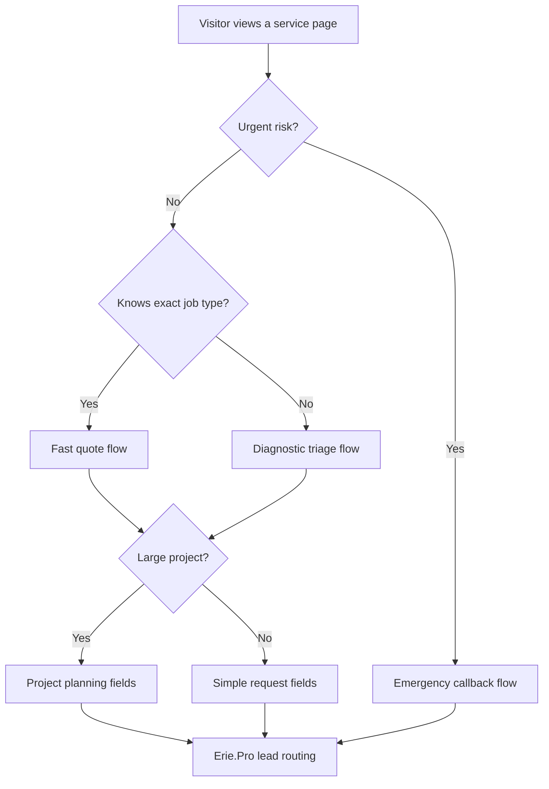

# Erie.Pro Service-Specific ConvertBox Blueprints

Date: 2026-05-10

This document expands the Erie.Pro ConvertBox plan into service-by-service journeys. It was originally drafted from the fetched GitHub `erie-pro` catalog, which only exposes 44 top-level service categories in the refs available to this workspace. That is incomplete for the current public website: the live `https://erie.pro` deployment presents 112 service options in its request form. Treat `ERIE-PRO-LIVE-SERVICE-INVENTORY.md` as the service source of truth for ConvertBox planning until the deployment source is reconciled.

## How To Use This

Every service gets three layers:

1. Service intent: what the visitor is trying to accomplish.
2. Subservice branches: the specific request types that should shape questions and urgency.
3. ConvertBox flow: the overlay, fields, triggers, and routing metadata.

Do not build 112 separate boxes manually at first. Build reusable ConvertBox templates, then duplicate and customize per service and subservice cluster.

## Flow Families

| Flow | Best For | User Experience |
|---|---|---|
| Emergency callback | Urgent, safety, damage, lockout, no heat, no water, vehicle disabled | Phone-first, shortest form, fast expectation setting |
| Fast quote | High-intent planned work | Name, phone/email, job type, location, timeline |
| Diagnostic triage | Problems where the user may not know the exact service | Ask symptoms first, then route to category |
| Cost confidence | Pricing/cost pages, comparison shoppers | Ask scope, property type, timeline, budget range |
| Appointment request | Health, dental, vet, chiropractic, accounting consults | Preferred day/time, insurance/payment, reason for visit |
| Project planning | Larger non-urgent projects | Scope, measurements/photos, timeline, decision stage |
| Checklist capture | Research pages and guides | Email-first, soft nurture, optional service/timeline |
| Provider claim | Businesses, contractors, professionals | Business info, niche, territory interest |

## Universal Branching Diagram



## Core Field Library

Use these as reusable field sets.

| Field Set | Fields |
|---|---|
| Contact minimum | name, phone, email |
| Location | zip, neighborhood, address optional |
| Timeline | emergency now, today, this week, this month, planning |
| Property type | house, condo, apartment, commercial, vehicle, pet, personal |
| Job details | subservice, symptom/problem, message |
| Safety details | active leak, no heat, electrical hazard, sewage, lockout, disabled vehicle, injury, break-in |
| Project scope | approximate size, number of rooms/items, photos available, budget range |
| Appointment | preferred day/time, insurance/payment, new/existing customer |
| Consent | permission to contact by phone/text/email |

## Service Matrix

### Plumbing

Subservices:
- Emergency pipe repair and leak detection
- Drain cleaning and sewer line service
- Water heater installation and repair
- Bathroom and kitchen remodeling
- Frozen pipe thawing and prevention
- Sump pump installation and maintenance
- Water softener installation
- Gas line installation and repair

Visitor journey:
- Emergency: water leak, frozen pipe, sewage backup, no hot water, gas smell.
- Planned: remodel, water heater replacement, water softener, inspection.
- Uncertain: symptom-based, such as slow drain, low pressure, smell, water spots.

ConvertBox flows:
- Emergency callback on emergency page, frozen pipe content, drain/sewer pages, exit intent.
- Diagnostic triage on general plumbing pages: "What plumbing problem are you dealing with?"
- Cost confidence on pricing/cost pages.

Key fields:
- Problem type, active leak yes/no, water shut off yes/no, location, timeline, phone.

Routing metadata:
- `niche=plumbing`, `intent=emergency|quote|diagnostic`, `subservice=<selected>`, `urgency=<level>`.

### HVAC

Subservices:
- Furnace repair and installation
- Air conditioning repair and replacement
- Heat pump service
- Ductwork installation and repair
- Indoor air quality and filtration
- Thermostat installation
- Boiler service
- Seasonal maintenance

Visitor journey:
- Emergency: no heat in winter, no cooling in heat wave, carbon monoxide concern.
- Planned: replacement quote, maintenance, air quality.
- Uncertain: noises, poor airflow, high bills, uneven temperatures.

ConvertBox flows:
- Emergency callback on no-heat/no-cooling pages.
- Diagnostic triage: heat, cooling, airflow, air quality, maintenance.
- Cost helper on replacement and pricing pages.

Key fields:
- System type, issue, age of system, emergency temperature concern, property type, phone.

Metadata:
- `niche=hvac`, `subservice=furnace|ac|heat-pump|ductwork|air-quality`, `season=winter|summer`.

### Electrical

Subservices:
- Wiring repair
- Panel upgrades
- Lighting installation
- Outlet and switch repair
- Generator installation
- EV charger installation
- Safety inspections
- Whole-home rewiring

Visitor journey:
- Emergency: burning smell, sparking outlet, partial power outage, exposed wires.
- Planned: panel upgrade, EV charger, lighting, generator.
- Compliance: inspections, permits, older home wiring.

ConvertBox flows:
- Safety-first emergency callback.
- Project planning for panel, generator, EV charger.
- Diagnostic triage for symptoms.

Key fields:
- Hazard present, breaker issue, project type, property age, permit need, timeline.

Metadata:
- `niche=electrical`, `safety_risk=true|false`, `subservice=<selected>`.

### Roofing

Subservices:
- Roof repair
- Full roof replacement
- Gutters
- Storm damage restoration
- Leak inspection
- Metal and shingle roofing
- Insurance claim assistance
- Emergency tarping

Visitor journey:
- Emergency: active leak, storm damage, missing shingles.
- Planned: replacement, inspection, gutter pairing.
- Insurance: needs documentation and estimate.

ConvertBox flows:
- Storm/leak emergency callback.
- Cost confidence for replacement.
- Project planning with roof age and material.

Key fields:
- Active leak, storm date, roof age, material, insurance claim yes/no, photos available.

Metadata:
- `niche=roofing`, `subservice=repair|replacement|storm|gutters`, `insurance_claim=<yes/no>`.

### Landscaping

Subservices:
- Lawn care
- Landscape design
- Hardscaping
- Seasonal maintenance
- Mulch and planting
- Drainage
- Retaining walls
- Snow-season property prep

Visitor journey:
- Planning and aesthetic decision-making.
- Seasonal urgency: spring cleanup, fall cleanup, storm cleanup.
- Larger projects need consultative scoping.

ConvertBox flows:
- Project planning.
- Seasonal checklist capture.
- Quote flow on service pages.

Key fields:
- Project type, property size, desired timeline, maintenance vs installation, photos.

Metadata:
- `niche=landscaping`, `intent=maintenance|design|hardscape|seasonal`.

### Dental

Subservices:
- General dentistry
- Cosmetic dentistry
- Orthodontics
- Oral surgery
- Emergency dental care
- Implants
- Cleanings
- Invisalign

Visitor journey:
- Emergency: pain, broken tooth, swelling.
- Appointment: cleaning, exam, new patient.
- Cosmetic: research-heavy, trust-heavy.

ConvertBox flows:
- Appointment request.
- Emergency dental callback.
- Soft guide for cosmetic or implant research.

Key fields:
- Reason for visit, pain level, new/existing patient, insurance, preferred appointment time.

Metadata:
- `niche=dental`, `intent=appointment|emergency|cosmetic`, `pain_level=<1-10>`.

### Legal

Subservices:
- Personal injury
- Family law
- Criminal defense
- Estate planning
- Immigration
- Business law
- Real estate law
- Free consultation

Visitor journey:
- High anxiety and confidentiality concern.
- Needs the right practice area before provider match.
- Urgency varies sharply by case type.

ConvertBox flows:
- Confidential consultation request.
- Practice-area triage.
- Emergency/urgent legal help for criminal, protection orders, time-sensitive deadlines.

Key fields:
- Practice area, deadline/court date, short confidential summary, preferred contact method.

Metadata:
- `niche=legal`, `practice_area=<selected>`, `deadline=<date/urgent>`.

### Cleaning

Subservices:
- House cleaning
- Commercial cleaning
- Deep cleaning
- Move-in/move-out cleaning
- Recurring maid service
- Post-construction cleaning
- Janitorial
- Specialty cleaning

Visitor journey:
- Convenience-driven, trust and scheduling matter.
- Often compares frequency and price.

ConvertBox flows:
- Fast quote.
- Cost helper based on home/business size.
- Recurring service offer.

Key fields:
- Property type, square footage/rooms, frequency, desired date, special needs.

Metadata:
- `niche=cleaning`, `subservice=deep|recurring|move|commercial`.

### Auto Repair

Subservices:
- Mechanical repair
- Body work
- Oil changes
- Diagnostics
- Brake repair
- Engine/transmission
- State inspection
- Tire and alignment

Visitor journey:
- Symptom-based and trust-sensitive.
- Urgent if car is unsafe or disabled.

ConvertBox flows:
- Diagnostic triage.
- Appointment request.
- Emergency/roadworthiness prompt if unsafe.

Key fields:
- Vehicle year/make/model, symptom, warning lights, drivable yes/no, preferred time.

Metadata:
- `niche=auto-repair`, `vehicle_status=drivable|not-drivable`, `subservice=<selected>`.

### Pest Control

Subservices:
- Insect control
- Rodent removal
- Termite treatment
- Prevention plans
- Bed bugs
- Wasps/hornets
- Wildlife exclusion
- Commercial pest control

Visitor journey:
- Discomfort, urgency, embarrassment, safety concerns.
- Needs identification and fast reassurance.

ConvertBox flows:
- Pest identifier triage.
- Emergency callback for bed bugs, wasps, rodents in living area.
- Prevention plan quote.

Key fields:
- Pest type, where seen, how long, children/pets, property type, timeline.

Metadata:
- `niche=pest-control`, `pest_type=<selected>`, `infestation_level=<light|moderate|severe>`.

### Painting

Subservices:
- Interior painting
- Exterior painting
- Staining
- Wallpaper
- Cabinet painting
- Commercial painting
- Drywall prep
- Color consultation

Visitor journey:
- Visual and trust-heavy.
- Needs estimate, timeline, room/exterior scope.

ConvertBox flows:
- Project planning.
- Cost helper.
- Checklist capture for color/project planning.

Key fields:
- Interior/exterior, rooms or surfaces, approximate size, paint supplied yes/no, timeline.

Metadata:
- `niche=painting`, `subservice=interior|exterior|cabinet|commercial`.

### Real Estate

Subservices:
- Buyer representation
- Seller representation
- Property management
- Appraisals
- Home valuation
- Investment property
- Relocation
- First-time buyer help

Visitor journey:
- High-value decision, relationship-based.
- Visitor may not be ready to talk immediately.

ConvertBox flows:
- Consultation request.
- Home valuation prompt.
- Buyer/seller journey selector.

Key fields:
- Buying/selling/managing, timeline, property address optional, budget/value range.

Metadata:
- `niche=real-estate`, `intent=buy|sell|manage|value`.

### Garage Door

Subservices:
- Spring replacement
- Opener installation and repair
- New door installation
- Panel replacement
- Track alignment
- Roller replacement
- Weatherstripping
- Keypad and remote programming

Visitor journey:
- Often urgent when door is stuck open/closed.
- Safety issue with broken springs/cables.

ConvertBox flows:
- Emergency callback for stuck door, broken spring, off-track.
- Fast quote for installation.

Key fields:
- Door stuck yes/no, spring/cable issue, opener issue, number of doors, timeline.

Metadata:
- `niche=garage-door`, `subservice=spring|opener|installation|stuck-door`, `urgency=<level>`.

### Fencing

Subservices:
- Wood fence
- Vinyl fence
- Aluminum/iron
- Chain link
- Fence repair
- Gate repair
- Snow fence
- Survey/permit assistance

Visitor journey:
- Project planning, property line concern, material comparison.
- Urgent only when storm damage or security/pet containment issue.

ConvertBox flows:
- Project planning.
- Material selector.
- Emergency repair for fallen fence/gate.

Key fields:
- Material, linear feet estimate, repair vs new, gate needed, survey status, timeline.

Metadata:
- `niche=fencing`, `subservice=<material/repair>`.

### Flooring

Subservices:
- Hardwood installation/refinishing
- Luxury vinyl plank
- Tile and stone
- Carpet
- Laminate
- Subfloor repair
- Waterproof basement flooring
- Commercial flooring

Visitor journey:
- Design, material, budget, disruption concerns.
- Urgent only for water-damaged floors.

ConvertBox flows:
- Project planning.
- Cost helper by room/square footage.
- Emergency water-damage floor repair.

Key fields:
- Material, rooms, square footage, subfloor issue, water damage, timeline.

Metadata:
- `niche=flooring`, `material=<selected>`, `water_damage=<yes/no>`.

### Windows & Doors

Subservices:
- Window replacement
- Entry doors
- Storm doors
- Sliding/patio doors
- Glass replacement
- Energy audits
- Bay/bow windows
- Egress windows

Visitor journey:
- Energy savings, comfort, security, curb appeal.
- Urgent if broken window/forced entry.

ConvertBox flows:
- Project planning.
- Energy upgrade cost helper.
- Emergency board-up/door repair prompt.

Key fields:
- Window/door count, broken/security issue, material preference, energy concern, timeline.

Metadata:
- `niche=windows-doors`, `intent=replacement|repair|energy|security`.

### Moving

Subservices:
- Local moving
- Long-distance moving
- Packing/unpacking
- Commercial moving
- Piano/specialty items
- Storage
- Senior moving
- Loading/unloading

Visitor journey:
- Deadline-driven, logistics-heavy.
- Needs availability and price quickly.

ConvertBox flows:
- Moving quote.
- Date availability checker.
- Specialty-item branch.

Key fields:
- Move date, origin/destination, bedrooms, stairs/elevator, packing, specialty items.

Metadata:
- `niche=moving`, `move_type=local|long-distance|commercial`, `move_date=<date>`.

### Tree Service

Subservices:
- Tree removal
- Trimming/pruning
- Stump grinding
- Storm cleanup
- Land clearing
- Health assessment
- Cabling/bracing
- Firewood

Visitor journey:
- Safety-sensitive when tree threatens property.
- Photo-driven and site assessment heavy.

ConvertBox flows:
- Emergency storm/tree-on-structure callback.
- Photo estimate prompt.
- Project planning for trimming/removal.

Key fields:
- Tree hazard, near structure/powerline, storm damage, stump needed, photos.

Metadata:
- `niche=tree-service`, `hazard=true|false`, `subservice=<selected>`.

### Appliance Repair

Subservices:
- Washer repair
- Dryer repair and vent cleaning
- Refrigerator/freezer
- Dishwasher
- Oven/range
- Microwave
- Ice maker
- Garbage disposal

Visitor journey:
- Symptom-based, fast scheduling.
- Urgent for refrigerator not cooling, gas smell, flooding washer.

ConvertBox flows:
- Diagnostic triage.
- Emergency appliance callback.
- Appointment request.

Key fields:
- Appliance type, brand, symptom, gas/electric, model optional, timeline.

Metadata:
- `niche=appliance-repair`, `appliance=<selected>`, `food_safety_or_leak=<yes/no>`.

### Foundation & Waterproofing

Subservices:
- Crack repair
- Basement waterproofing
- Bowed wall stabilization
- Sump pump
- French drains
- Crawl space encapsulation
- Pier installation
- Structural inspections

Visitor journey:
- Anxiety about home safety and cost.
- Needs expert inspection, reassurance, and clear next step.

ConvertBox flows:
- Inspection request.
- Emergency flooding/sump failure prompt.
- Diagnostic triage for cracks/water/walls.

Key fields:
- Water present, crack size/location, bowed wall, sump pump status, photos, timeline.

Metadata:
- `niche=foundation`, `subservice=waterproofing|crack|structural|sump`, `risk=<level>`.

### Home Security

Subservices:
- Security systems
- Cameras
- Monitoring
- Smart locks
- Video doorbells
- Alarm upgrades
- Home automation
- Fire/CO monitoring

Visitor journey:
- Fear, protection, privacy, contract skepticism.
- Urgent after break-in or system failure.

ConvertBox flows:
- Security assessment.
- Emergency post-break-in/system repair.
- Smart-home planning.

Key fields:
- Property type, reason for security, cameras/locks/monitoring, current system, timeline.

Metadata:
- `niche=home-security`, `intent=assessment|repair|install`, `trigger=break-in|upgrade|new-home`.

### Concrete & Masonry

Subservices:
- Driveways
- Patios
- Sidewalks
- Foundations/footings
- Stamped concrete
- Repair/resurfacing
- Retaining walls
- Garage floors

Visitor journey:
- Project planning and weather/seasonal timing.
- Safety urgency for trip hazards or foundation work.

ConvertBox flows:
- Project quote.
- Cost helper by square footage.
- Safety repair prompt.

Key fields:
- Project type, approximate dimensions, new vs repair, access, timeline.

Metadata:
- `niche=concrete`, `subservice=<selected>`, `safety_hazard=<yes/no>`.

### Septic & Sewer

Subservices:
- Septic pumping
- Inspections
- Drain field repair
- System installation
- Grease trap pumping
- Tank repair
- Design/permitting
- Emergency septic service

Visitor journey:
- High urgency when backup/odor/surfacing occurs.
- Compliance and property sale inspection needs.

ConvertBox flows:
- Emergency sewage backup prompt.
- Inspection/pumping appointment.
- System repair planning.

Key fields:
- Backup yes/no, odor/surfacing, tank last pumped, property type, timeline.

Metadata:
- `niche=septic`, `subservice=pumping|inspection|backup|installation`, `health_risk=<yes/no>`.

### Chimney & Fireplace

Subservices:
- Chimney sweeping
- Inspections
- Cap/crown repair
- Tuckpointing
- Relining
- Fireplace repair
- Waterproofing
- Creosote removal

Visitor journey:
- Seasonal safety before winter.
- Urgent for chimney fire, carbon monoxide concern, storm damage.

ConvertBox flows:
- Inspection appointment.
- Emergency safety prompt.
- Seasonal winter-prep checklist.

Key fields:
- Fireplace type, last inspection, issue, smoke/CO concern, timeline.

Metadata:
- `niche=chimney`, `safety_risk=<yes/no>`, `subservice=<selected>`.

### Pool & Spa

Subservices:
- Opening/closing
- Weekly maintenance
- Equipment repair
- Hot tub/spa service
- Liner replacement
- Heater installation
- Water chemistry
- Leak detection

Visitor journey:
- Seasonal and maintenance-driven.
- Urgent for leaks, pump failure, electrical hot tub issues.

ConvertBox flows:
- Seasonal service booking.
- Equipment repair triage.
- Leak emergency prompt.

Key fields:
- Pool/spa type, issue, opening/closing, equipment affected, timeline.

Metadata:
- `niche=pool-spa`, `subservice=maintenance|repair|opening|leak`.

### Locksmith

Subservices:
- Emergency lockout
- Lock installation/repair
- Rekeying
- Key cutting
- Smart locks
- Commercial locks
- Automotive locksmith
- Master key systems

Visitor journey:
- Often urgent and mobile.
- Trust and transparent pricing matter.

ConvertBox flows:
- 24/7 lockout callback.
- Fast quote for rekey/install.
- Commercial security branch.

Key fields:
- Lockout type, location, vehicle/home/business, ID/access issue, phone.

Metadata:
- `niche=locksmith`, `intent=lockout|rekey|install|auto`, `urgency=high`.

### Towing & Roadside Assistance

Subservices:
- Emergency towing
- Flatbed towing
- Roadside assistance
- Jump starts
- Tire changes
- Vehicle recovery
- Long-distance towing
- Lockout assistance

Visitor journey:
- Immediate stress, mobile, safety-sensitive.
- Needs location and phone above all.

ConvertBox flows:
- Emergency roadside callback.
- Disable all long-form quote prompts.

Key fields:
- Phone, current location, vehicle, issue, destination optional, safety concern.

Metadata:
- `niche=towing`, `subservice=tow|jump|tire|recovery|lockout`, `urgency=high`.

### Carpet Cleaning

Subservices:
- Steam cleaning
- Stain removal
- Upholstery
- Rug cleaning
- Pet odor
- Commercial carpet
- Protection treatment
- Tile/grout

Visitor journey:
- Price/scheduling, trust in results.
- Urgent for flood/water extraction.

ConvertBox flows:
- Quote by room count.
- Stain/pet odor triage.
- Emergency flood extraction.

Key fields:
- Rooms/items, stain type, pets, preferred date, emergency water damage yes/no.

Metadata:
- `niche=carpet-cleaning`, `subservice=<selected>`, `rooms=<count>`.

### Pressure Washing

Subservices:
- House washing
- Driveway/sidewalk
- Deck/patio
- Fence cleaning
- Gutter exterior
- Commercial washing
- Roof soft washing
- Concrete sealing

Visitor journey:
- Visual improvement, seasonal maintenance.
- Needs surface type and estimate.

ConvertBox flows:
- Project quote.
- Seasonal exterior refresh prompt.

Key fields:
- Surface type, approximate size, material, stains/mold, timeline.

Metadata:
- `niche=pressure-washing`, `surface=<selected>`.

### Drywall & Plastering

Subservices:
- Drywall repair
- New drywall
- Finishing/taping
- Ceiling repair
- Texture matching
- Plaster repair
- Water damage replacement
- Soundproofing

Visitor journey:
- Repair vs renovation, quality/texture concern.
- Urgent when water damage is active.

ConvertBox flows:
- Repair quote.
- Water damage emergency prompt.
- Project planning for new install.

Key fields:
- Repair/new, area size, ceiling/wall, texture match, water damage, photos.

Metadata:
- `niche=drywall`, `subservice=repair|install|ceiling|water-damage`.

### Insulation

Subservices:
- Attic insulation
- Spray foam
- Blown-in
- Crawl space
- Wall retrofit
- Energy audits
- Air sealing
- Removal/replacement

Visitor journey:
- Comfort and energy bill problem.
- Needs assessment, rebates, material guidance.

ConvertBox flows:
- Energy assessment request.
- Cost helper.
- Winter comfort prompt.

Key fields:
- Area, home age, comfort issue, current insulation known, rebate interest.

Metadata:
- `niche=insulation`, `intent=energy-savings|comfort|retrofit`.

### Solar & Energy

Subservices:
- Solar installation
- Energy audits
- Battery storage
- Maintenance
- Monitoring
- EV charger integration
- Grid-tie
- Off-grid

Visitor journey:
- High-consideration, financial ROI, incentives.
- Needs education before sales call.

ConvertBox flows:
- Solar assessment.
- Savings estimate capture.
- Guide/checklist capture for research.

Key fields:
- Electric bill range, roof ownership, shade, battery interest, EV interest, timeline.

Metadata:
- `niche=solar`, `intent=assessment|battery|ev|audit`.

### Gutters

Subservices:
- Gutter cleaning
- Seamless installation
- Gutter guards
- Repair
- Downspouts
- Replacement
- Ice dam prevention
- Fascia repair

Visitor journey:
- Seasonal and problem-driven: overflow, leaks, ice dams.
- Urgent after storm detachment.

ConvertBox flows:
- Fast quote.
- Storm repair prompt.
- Fall maintenance checklist.

Key fields:
- Cleaning/repair/install, stories, visible damage, overflow, gutter guards, timeline.

Metadata:
- `niche=gutters`, `subservice=cleaning|repair|guards|installation`, `storm_damage=<yes/no>`.

### Handyman

Subservices:
- General repairs
- Furniture assembly
- Fixture installation
- Doors/windows
- Caulking/weatherstripping
- Minor plumbing/electrical
- Shelving/storage
- Seasonal maintenance

Visitor journey:
- Convenience, small jobs, trust in person entering home.
- Needs scope bundling.

ConvertBox flows:
- "Build my repair list" diagnostic.
- Fast quote for small tasks.

Key fields:
- Task list, number of tasks, home/business, materials purchased, preferred date.

Metadata:
- `niche=handyman`, `task_count=<count>`, `subservice=<selected>`.

### Veterinary

Subservices:
- Wellness exams
- Vaccinations
- Spay/neuter
- Dental care
- Emergency/urgent care
- Diagnostics
- Surgery
- Senior pet care
- Microchipping

Visitor journey:
- Pet health anxiety and availability.
- Emergency flows must be clear and responsible.

ConvertBox flows:
- Appointment request.
- Urgent pet care prompt.
- New patient capture.

Key fields:
- Pet type, reason, symptoms, urgency, new/existing patient, preferred time.

Metadata:
- `niche=veterinary`, `intent=appointment|urgent`, `pet_type=<selected>`.

### Chiropractic

Subservices:
- Spinal adjustments
- Back pain
- Neck pain
- Sciatica
- Sports injury
- Prenatal chiropractic
- Pediatric chiropractic
- Posture correction

Visitor journey:
- Pain-driven, seeks relief and trust.
- Often wants same-day availability.

ConvertBox flows:
- Same-day appointment request.
- Pain triage.
- Insurance/payment question.

Key fields:
- Pain area, pain level, injury cause, insurance, preferred appointment.

Metadata:
- `niche=chiropractic`, `pain_area=<selected>`, `pain_level=<1-10>`.

### Accounting & Tax

Subservices:
- Individual tax prep
- Business tax prep
- Bookkeeping
- Payroll
- Financial planning
- Business formation
- IRS representation
- QuickBooks setup

Visitor journey:
- Deadline, compliance, money anxiety.
- Urgent around tax season, notices, audits.

ConvertBox flows:
- Consultation request.
- Deadline triage.
- Tax checklist capture.

Key fields:
- Individual/business, filing year, deadline/notice, books current yes/no, preferred consult time.

Metadata:
- `niche=accounting`, `subservice=tax|bookkeeping|payroll|irs|formation`, `deadline=<date>`.

### Photography

Subservices:
- Portraits
- Weddings
- Events
- Real estate
- Headshots
- Family
- Senior portraits
- Commercial product

Visitor journey:
- Date availability and style fit.
- Portfolio trust matters.

ConvertBox flows:
- Date availability request.
- Package quote.
- Style guide/checklist capture.

Key fields:
- Shoot type, date, location, number of people/properties/products, deliverables.

Metadata:
- `niche=photography`, `shoot_type=<selected>`, `event_date=<date>`.

### Pet Grooming

Subservices:
- Dog grooming
- Cat grooming
- Bath/blow-dry
- Haircuts
- Nail trimming
- Ear cleaning
- De-shedding
- Medicated baths

Visitor journey:
- Convenience, pet safety, breed/coat concerns.
- Anxiety around nervous or matted pets.

ConvertBox flows:
- Appointment request.
- Breed/coat triage.
- Mobile grooming branch.

Key fields:
- Pet type/breed, size, service needed, matted/anxious yes/no, preferred date.

Metadata:
- `niche=pet-grooming`, `pet_type=<selected>`, `special_handling=<yes/no>`.

### Snow Removal

Subservices:
- Residential plowing
- Commercial lot clearing
- Sidewalk clearing
- De-icing
- Roof snow removal
- Snow hauling
- Seasonal contracts
- 24/7 storm response

Visitor journey:
- Erie-specific urgency during storms.
- Contracting before season vs emergency storm help.

ConvertBox flows:
- Storm response callback.
- Seasonal contract quote.
- Commercial snow plan.

Key fields:
- Residential/commercial, driveway/lot size, contract vs one-time, current storm yes/no.

Metadata:
- `niche=snow-removal`, `intent=storm|seasonal|commercial`, `urgency=<level>`.

### Restoration

Subservices:
- Water damage
- Flood extraction
- Mold remediation
- Fire/smoke
- Storm damage
- Sewage cleanup
- Content restoration
- Structural drying

Visitor journey:
- Emergency, panic, insurance concern.
- Speed is critical and copy should be calm.

ConvertBox flows:
- 24/7 emergency callback.
- Damage triage.
- Insurance assistance branch.

Key fields:
- Damage type, active water/fire/smoke, affected area, insurance claim, phone, address.

Metadata:
- `niche=restoration`, `damage_type=<selected>`, `urgency=critical`.

### Glass & Glazing

Subservices:
- Window glass repair
- Shower enclosures
- Mirrors
- Storefront glass
- Tabletop glass
- Insulated glass units
- Emergency board-up
- Auto glass

Visitor journey:
- Urgent for break-in/storm, planned for custom glass.
- Needs measurements/photos.

ConvertBox flows:
- Emergency board-up prompt.
- Custom glass quote.
- Repair/replacement triage.

Key fields:
- Glass type, broken/security issue, dimensions/photos, residential/commercial, timeline.

Metadata:
- `niche=glass`, `subservice=board-up|window|shower|storefront|auto`, `security_risk=<yes/no>`.

### Irrigation & Sprinklers

Subservices:
- Installation
- Repair
- Winterization
- Spring startup
- Head/nozzle replacement
- Controller programming
- Drip irrigation
- Backflow testing

Visitor journey:
- Seasonal maintenance and repair.
- Urgent when broken pipe/main line wastes water.

ConvertBox flows:
- Seasonal startup/winterization booking.
- Repair triage.
- Installation planning.

Key fields:
- System exists yes/no, issue, zone count, water leak yes/no, seasonal service needed.

Metadata:
- `niche=irrigation`, `subservice=startup|winterization|repair|installation`, `leak=<yes/no>`.

### Demolition & Excavation

Subservices:
- Building demolition
- Interior demolition
- Site clearing
- Excavation/grading
- Concrete removal
- Pool removal
- Foundation excavation
- Land clearing

Visitor journey:
- Large project, permitting, environmental risk, equipment/access.
- Urgent only for unsafe structures/storm damage.

ConvertBox flows:
- Project planning.
- Unsafe structure emergency prompt.
- Permit/readiness checklist capture.

Key fields:
- Project type, structure size, permits, utilities disconnected, access, timeline.

Metadata:
- `niche=demolition`, `subservice=<selected>`, `permit_needed=<yes/no>`, `safety_risk=<yes/no>`.

## Campaign Build Order

Build these in batches so the system stays manageable.

### Batch 1: Urgent Home Services

- Plumbing
- HVAC
- Electrical
- Roofing
- Garage Door
- Tree Service
- Foundation
- Septic
- Restoration
- Locksmith
- Towing

Flows:
- Emergency callback
- Diagnostic triage
- Fast quote

### Batch 2: High-Value Planned Projects

- Windows & Doors
- Flooring
- Fencing
- Concrete
- Solar
- Insulation
- Landscaping
- Painting
- Demolition

Flows:
- Project planning
- Cost confidence
- Checklist capture

### Batch 3: Recurring And Seasonal Services

- Cleaning
- Pest Control
- Pool & Spa
- Gutters
- Pressure Washing
- Snow Removal
- Irrigation
- Carpet Cleaning
- Handyman

Flows:
- Seasonal booking
- Fast quote
- Maintenance checklist

### Batch 4: Appointment-Based Services

- Dental
- Veterinary
- Chiropractic
- Accounting
- Photography
- Pet Grooming
- Legal
- Real Estate
- Auto Repair
- Appliance Repair
- Chimney
- Home Security

Flows:
- Appointment request
- Consultation request
- Diagnostic/availability triage

## ConvertBox Naming Standard

Use this naming format:

```text
EriePro - [Niche] - [Flow] - [Audience]
```

Examples:

- `EriePro - Plumbing - Emergency Callback - Consumer`
- `EriePro - HVAC - Diagnostic Triage - Consumer`
- `EriePro - Roofing - Storm Damage Quote - Consumer`
- `EriePro - Legal - Consultation Request - Consumer`
- `EriePro - Plumbing - Territory Claim - Provider`

## Final UX Rule

The more urgent the service, the shorter the ConvertBox.

The more expensive or planned the service, the more consultative the ConvertBox.

The more trust-sensitive the service, the more the copy should emphasize privacy, verification, and no obligation.
