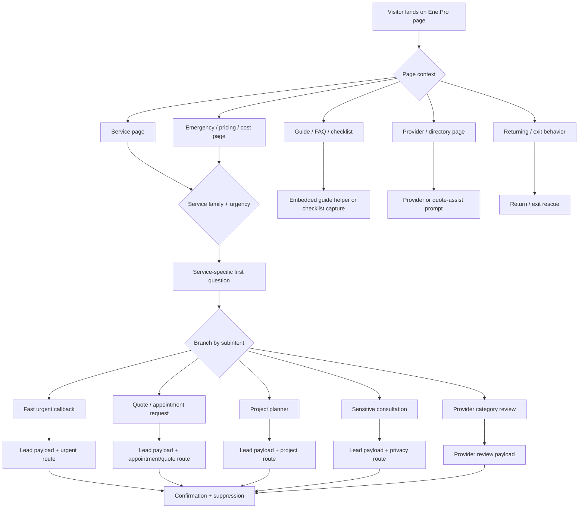

# Erie.Pro ConvertBox Master Plan For All 112 Services

Date: 2026-05-10

Purpose: define the complete Erie.Pro ConvertBox system for every live niche, service, and subservice path. This plan is the operating blueprint for turning ConvertBox into a polite, high-converting Erie County concierge layer without overwhelming visitors.

## Source Of Truth

- Live service count: 112 services.
- Live source document: `docs/erie-pro-consolidation/LIVE-SERVICE-INVENTORY.md`.
- Current service-to-family matrix: `SERVICE-FAMILY-MAP.csv`.
- Current draft prototype boxes: 10 inactive ConvertBox drafts in the Erie.Pro ConvertBox site.
- Current copy state: persona rewrite applied to all 10 inactive drafts.

The 10 current boxes are prototypes and base templates. The final system is not 10 generic boxes. The final system is a service-aware conversion engine made of family templates, service variants, subservice branches, urgency branches, and page-context rules.

## ConvertBox Features To Use Fully

This plan deliberately uses the strongest ConvertBox capabilities rather than treating ConvertBox as a simple popup tool.

References consulted:

- ConvertBox multi-step funnels: https://support.convertbox.com/knowledge-base/creating-multiple-steps-for-your-convertbox/
- Button actions, custom field values, quiz scoring, stop-showing controls, and integrations: https://support.convertbox.com/knowledge-base/button-actions-and-integrations/
- Form actions, conditional actions, conditional integrations, redirects, tracking scripts, and open-another-ConvertBox actions: https://support.convertbox.com/knowledge-base/form-actions-and-integrations/
- Visitor targeting rules: https://support.convertbox.com/knowledge-base/visitor-targeting-rules-overview/
- Link-triggered ConvertBoxes and micro-commitment triggers: https://support.convertbox.com/knowledge-base/trigger-a-convertbox-from-clicking-a-link/
- Embedded ConvertBoxes: https://support.convertbox.com/knowledge-base/how-to-embed-convertbox/
- A/B testing and cookied tests: https://support.convertbox.com/knowledge-base/how-to-split-test-your-convertbox/
- Stats and step breakdowns: https://support.convertbox.com/knowledge-base/viewing-statistics/
- Groups for operational organization: https://support.convertbox.com/knowledge-base/campaigns/
- Zapier/webhook-style routing: https://support.convertbox.com/knowledge-base/zapier-integration/

Required feature usage:

- Steps: every flow must use native ConvertBox steps where the visitor needs progressive choice, triage, contact, and confirmation.
- Button actions: all first-step choices must set intent metadata and move the visitor to the right next step.
- Form actions: submit actions must open a confirmation step, fire tracking where appropriate, optionally redirect or open a follow-up ConvertBox, and stop showing after submission.
- Conditional actions: urgent/sensitive/provider/service-specific paths must jump to the correct next step rather than forcing one generic sequence.
- Conditional integrations: leads must be tagged by service, family, urgency, page type, persona, and route.
- Custom fields: buttons must set fields such as `ep_service`, `ep_family`, `ep_subintent`, `ep_urgency`, `ep_persona`, `ep_page_type`, `ep_zip_or_community`, and `ep_route`.
- Quiz scoring: use only where useful, mainly provider fit, project readiness, and lead temperature. Do not gamify urgent or sensitive human situations.
- Link triggers: use on Erie.Pro CTAs because the click is a micro-commitment and should convert better than unsolicited interruption.
- Embedded boxes: use inside authority pages, pricing pages, comparison pages, guide pages, and provider pages where an inline concierge is more respectful than an overlay.
- Targeting rules: show boxes only where page context and visitor behavior imply helpfulness.
- A/B tests: use cookied tests for offer/headline/step-order tests so one visitor sees one coherent experience.
- Stats: review overall conversion, step drop-off, first-choice distribution, form submission, and service-family performance.
- Groups: organize boxes by objective and family, not by random creation history.
- Sharing/import: use only after a template is proven and needs duplication across similar Erie.Pro or future client sites.

## Conversion Doctrine

### Principle 1: Help Before Capture

The box should first help the visitor understand the next right step. Contact capture comes after the visitor has already made a small commitment: choosing a need, urgency, service type, or desired outcome.

### Principle 2: Persona Before Form

Every flow must be shaped by the visitor's mental state:

- Emergency visitor: stressed, impatient, phone-first.
- Project visitor: wants confidence, scope clarity, budget/timing realism.
- Seasonal visitor: reacting to weather, deadlines, storms, or maintenance windows.
- Cleaning/turnover visitor: wants readiness by a date.
- Pest/environmental visitor: concerned, uncomfortable, possibly embarrassed.
- Auto/roadside/marine visitor: location and asset status matter.
- Health/care visitor: privacy, appointment fit, respect.
- Professional/legal/financial visitor: trust, deadlines, sensitivity.
- Provider visitor: business upside, territory availability, lead quality.
- Returning visitor: wants continuity, not restart.

### Principle 3: No Generic Ask

The first visible question should prove Erie.Pro understands the page context. A plumbing visitor should not see the same wording as a mental-health visitor, funeral-home visitor, snow-removal visitor, or provider.

### Principle 4: Progressive Disclosure

Ask the fewest questions needed for the next useful action. Deeper scoping belongs only where it increases lead quality without killing momentum.

### Principle 5: Permission And Control

Every box should feel optional and useful. Use suppression after close and submission. Never stack boxes in the same session. Never interrupt a visitor already completing the native Erie.Pro request form.

### Principle 6: Branches Are Assets

Every meaningful branch should create routing metadata. A visitor's answer is not just UI navigation; it is lead intelligence.

### Principle 7: Local Trust

Copy should always feel Erie County-specific, not "30-mile" or generic local SEO language. Use Erie County, local pro, local appointment, local provider, weather context, and community/ZIP where relevant.

## System Architecture

## Campaign Groups

Create or preserve these ConvertBox groups:

- `Erie.Pro - Core`: homepage, service finder, returning visitor, exit rescue.
- `Erie.Pro - Emergency`: phone-first urgent flows.
- `Erie.Pro - Service Families`: family templates and production variants.
- `Erie.Pro - Seasonal`: Erie weather, lakefront, storm, snow, holiday, and maintenance flows.
- `Erie.Pro - Appointments`: health, pet, care, and privacy-first appointment flows.
- `Erie.Pro - Professional`: legal, financial, real estate, funeral, inspection, estate, and consultation flows.
- `Erie.Pro - Provider Acquisition`: provider claim, category availability, profile claim, territory interest.
- `Erie.Pro - Research Nurture`: guides, checklists, pricing explainers, comparison helpers.
- `Erie.Pro - QA Drafts`: inactive staging only.

## Box And Template Architecture

### Core Production Templates

1. `EP-C01 Service Finder Concierge`
   - Audience: unsure visitors on homepage, `/services`, broad guides, and city pages.
   - Format: slide-in desktop, bottom bar mobile, embedded variant on `/services`.
   - Goal: classify need into service/family without forcing the visitor to know the exact label.
   - Steps: need type, urgency, community/ZIP, contact or redirect to service page.

2. `EP-C02 Emergency Callback`
   - Audience: urgent home/property/roadside/pest/weather visitors.
   - Format: click-triggered modal for CTAs, small slide-in for emergency pages after short delay, exit intent on emergency pages.
   - Goal: phone-first urgent lead capture.
   - Steps: urgent issue, location/risk, fastest contact, confirmation.

3. `EP-C03 Fast Quote`
   - Audience: standard quote visitors where scoping is short.
   - Format: slide-in, embedded large on pricing/cost pages, modal only on CTA click.
   - Goal: get enough context for a useful provider quote.
   - Steps: service-specific task, size/context, timing, contact, confirmation.

4. `EP-C04 Appointment / Consultation Request`
   - Audience: health, care, professional, legal, financial, inspection, funeral, estate, and property-consultation visitors.
   - Format: click-triggered or slide-in, never aggressive.
   - Goal: privacy-safe request for a first conversation.
   - Steps: type of help, timing/deadline, privacy-safe note, contact, confirmation.

5. `EP-C05 Project Planner`
   - Audience: high-value planned home projects.
   - Format: multi-step modal on CTA click, slide-in after deeper intent, embedded variant on long guides.
   - Goal: improve lead quality by gathering stage, scope, constraints, and timing.
   - Steps: project type, decision stage, scope, timing/budget, constraints, contact/concierge, confirmation.

6. `EP-C06 Seasonal Erie Helper`
   - Audience: Erie weather/seasonal visitors.
   - Format: seasonal slide-in and embedded helper.
   - Goal: account for timing, storm context, one-time vs recurring need.
   - Steps: seasonal task, weather/safety/timing, property context, contact, confirmation.

7. `EP-C07 Pest / Environmental Concern`
   - Audience: pest, mold, radon, wildlife, bats, wasps, well water.
   - Format: respectful slide-in or click modal.
   - Goal: calm triage without shame.
   - Steps: concern noticed, location/severity, occupants/safety, testing/removal, contact, confirmation.

8. `EP-C08 Auto / Roadside / Marine`
   - Audience: vehicle, towing, boat, dock, winterization visitors.
   - Format: urgent variant for towing, quote/project variant for repair/marine/dock.
   - Goal: capture asset, location, usability, timing.
   - Steps: asset type, location, issue/status, timing/destination, contact, confirmation.

9. `EP-C09 Provider Category Availability`
   - Audience: local providers.
   - Format: slide-in, embedded on provider acquisition pages, click-triggered modal on claim CTAs.
   - Goal: business owner lead capture and category/territory fit.
   - Steps: service category, communities served, business details, response capacity, owner contact, confirmation.

10. `EP-C10 Return / Exit Rescue`
    - Audience: returning visitors and high-intent abandoning visitors.
    - Format: exit intent desktop, soft bottom bar mobile, returning visitor prompt.
    - Goal: help visitor continue without restarting.
    - Steps: what got in the way, next step/contact, confirmation.

11. `EP-C11 Pricing Confidence Helper`
    - Audience: visitors on pricing/cost pages.
    - Format: embedded first, slide-in after scroll/time.
    - Goal: convert research into quote/appointment without being pushy.
    - Steps: price concern, scope factor, timing, contact, confirmation.

12. `EP-C12 Comparison / Provider Choice Helper`
    - Audience: directory, compare, reviews, best-provider pages.
    - Format: embedded or slide-in.
    - Goal: guide visitors from comparison to action.
    - Steps: what matters most, service/urgency, location, contact, confirmation.

## Family Blueprints

### Emergency Home Response

Services: Plumbing, HVAC, Electrical, Roofing, Garage Door, Appliance Repair, Septic & Sewer, Locksmith Services, Water Damage Restoration, Glass & Glazing, Fire Damage Restoration, Storm Damage Repair, Water Heater Services, Drain Cleaning, Sewer Line Repair, AC Repair, Furnace Repair, Ice Dam Removal, Emergency Board-Up, Basement Flood Cleanup.

Primary visitor state: stress, interruption, property risk, family safety, cold/heat/water/power concern.

First screen:

- Headline pattern: `Need urgent local help?`
- Body pattern: `Tell us what happened and where you are in Erie County. If anyone is in immediate danger, call 911 first.`
- Buttons:
  - `Water, heat, power, or storm`
  - `Lockout, access, or roadside`
  - `Help me choose the urgent path`

Required subservice branches:

- Water active: leak, backup, no hot water, flooding, sewer smell.
- Comfort active: no heat, no cooling, unsafe temperature, furnace/AC failure.
- Electrical active: sparks, burning smell, exposed wires, outage, panel concern.
- Weather active: storm, roof leak, ice dam, board-up, basement flood.
- Access active: lockout, garage door stuck, broken glass, urgent entry/security.

Required fields:

- `ep_service`
- `ep_subintent`
- `ep_urgency=emergency|urgent`
- `safety_or_damage_flag`
- `property_type`
- `zip_or_community`
- `phone` required
- `short_description`

Conversion rules:

- Phone before email.
- Do not ask budget.
- Do not ask long scope questions.
- Use direct CTA: `Send urgent request`.
- Confirmation: tell them to keep phone nearby.
- Stop showing after submit.

### Planned Home Projects

Services: Painting, Fencing, Flooring, Windows & Doors, Foundation & Waterproofing, Home Security, Concrete & Masonry, Drywall & Plastering, Insulation Services, Solar & Energy, Handyman Services, Demolition & Excavation, General Contractor, Home Remodeling, Kitchen Remodeling, Bathroom Remodeling, Siding, Decks & Patios, Basement Finishing, Duct Cleaning, Driveway Paving, Home Builders, Fence Repair, Retaining Walls, Epoxy Flooring, Closet & Storage Systems, Cabinet Refinishing, Countertops, Tile Installation, Smart Home Installation, EV Charger Installation, Generator Installation.

Primary visitor state: comparing cost, worried about quality, scope uncertainty, scheduling disruption.

Required branches:

- Repair/replacement.
- Remodel/build.
- Energy/comfort/safety upgrade.
- Specialty install.
- Not sure/scope help.

Required fields:

- `project_type`
- `decision_stage`
- `scope_details`
- `property_type`
- `size_or_count`
- `timeline`
- `budget_range_optional`
- `constraints`
- `zip_or_community`
- `contact`

Conversion rules:

- Longer flows are acceptable when project value is high.
- Ask budget as optional range, never as a hard gate.
- Add optional photo note where supported by form flow or downstream page.
- Use CTA: `Send project details`, `Start project match`.
- Confirmation should emphasize prepared first conversation.

### Seasonal Erie Services

Services: Landscaping, Tree Service, Chimney & Fireplace, Pool & Spa Services, Gutter Services, Snow Removal, Irrigation & Sprinklers, Asphalt Sealing, Commercial Snow Removal, Outdoor Lighting, Holiday Lighting, Lakefront Property Maintenance, Snow Plow Contractors, Salt & De-Icing Services, Storm Window Repair.

Primary visitor state: seasonal deadline, storm response, lake-effect weather, property readiness.

Required branches:

- Storm help now.
- One-time seasonal service.
- Recurring/contract service.
- Inspection/maintenance.
- Install/removal/design.

Required fields:

- `seasonal_task`
- `weather_or_storm_flag`
- `property_type`
- `one_time_or_recurring`
- `date_or_window`
- `community_or_zip`
- `contact`

Conversion rules:

- Trigger based on season and weather pages.
- Use urgent variant for snow, tree damage, ice, salt/de-icing.
- Use embedded helper on seasonal guides.

### Cleaning And Turnover

Services: Cleaning, Moving, Carpet Cleaning, Pressure Washing, Junk Removal, Dumpster Rental, Rental Turnover Cleaning, Commercial Cleaning, Vacation Rental Cleaning.

Primary visitor state: wants something clean, moved, removed, or ready by a date.

Required branches:

- Residential cleaning.
- Commercial cleaning.
- Turnover/vacation rental.
- Moving/junk/dumpster.
- Surface cleaning.

Required fields:

- `service_type`
- `property_type`
- `size_or_rooms`
- `item_volume`
- `date_needed`
- `access_notes`
- `zip_or_community`
- `contact`

Conversion rules:

- Date pressure is central.
- Ask access notes earlier than in normal project flows.
- Confirmation should say timing and access details are included.

### Pest And Environmental

Services: Pest Control, Mold Remediation, Radon Testing & Mitigation, Wildlife Removal, Bat Removal, Bee/Wasp Removal, Well Water Testing.

Primary visitor state: discomfort, worry, health concern, possible embarrassment.

Required branches:

- Active pest/wildlife.
- Sting/bite/exposure risk.
- Mold/water source.
- Testing/inspection.
- Remediation/removal.

Required fields:

- `concern_type`
- `location_in_property`
- `severity`
- `sensitive_occupants`
- `testing_or_removal`
- `timeline`
- `contact`

Conversion rules:

- Calm, nonjudgmental copy.
- Mention privacy.
- Use safety language without panic.
- Do not use cute pest language.

### Auto, Roadside, And Marine

Services: Auto Repair, Towing & Roadside Assistance, Boat Repair / Marine Services, Dock Installation & Repair, Marina / Boat Winterization.

Primary visitor state: stuck, diagnosing, seasonal marine deadline, location-specific issue.

Required branches:

- Roadside now.
- Auto repair quote.
- Boat repair/service.
- Dock install/repair.
- Winterization/storage.

Required fields:

- `asset_type`
- `current_location`
- `issue`
- `drivable_or_usable`
- `destination_optional`
- `timing`
- `contact`

Conversion rules:

- For towing, location and phone are first.
- For marine, ask location, boat type, seasonal window.
- For dock, use project planner depth.

### Health And Appointments

Services: Dental, Veterinary Services, Chiropractic Care, Pet Grooming, Optometry, Dermatology, Physical Therapy, Mental Health Counseling, Senior Home Care, Home Health Care, Hearing Aids / Audiology.

Primary visitor state: choosing a person/clinic/caregiver, sensitive appointment fit, privacy.

Required branches:

- Routine appointment.
- New concern.
- Follow-up care.
- Caregiver/home support.
- Pet visit/grooming.
- Private help choosing.

Required fields:

- `care_type`
- `preferred_window`
- `new_or_existing`
- `privacy_safe_summary`
- `insurance_or_payment_note_optional`
- `contact`

Conversion rules:

- No aggressive urgency unless explicitly an emergency disclaimer is needed.
- Use `Share only what you are comfortable sharing`.
- For mental health, senior care, and home health, use warmer language.
- For medical danger, instruct emergency services.

### Professional And Financial

Services: Legal, Real Estate, Accounting & Tax, Photography Services, Home Inspection, Property Management, Septic Inspection, Airbnb Property Management, Funeral Homes, Insurance Agents, Financial Advisors, Mortgage Brokers, Estate Sale Services.

Primary visitor state: high-trust decision, deadlines, documents, family/money/property sensitivity.

Required branches:

- Legal/matter type.
- Tax/accounting/finance/insurance/mortgage.
- Real estate/property/inspection.
- Event/photo/date.
- Funeral/estate/life-event.
- Property management/Airbnb.

Required fields:

- `matter_type`
- `deadline_or_date`
- `personal_business_property_context`
- `privacy_safe_summary`
- `preferred_contact_window`
- `contact`

Conversion rules:

- Do not ask for confidential details.
- Funeral and estate sale flows need gentler copy than mortgage or insurance.
- Deadline question is high-value and should appear early.
- Confirmation should promise respectful next conversation, not instant sales pressure.

### Provider Acquisition

Services: all provider-facing pages, profiles, category pages, and provider claim CTAs.

Primary visitor state: business owner wants lead quality, exclusivity, territory, and low wasted time.

Required branches:

- Existing profile claim.
- New provider interest.
- Home/property service.
- Health/professional/appointment service.
- Multi-service provider.
- Category not listed.

Required fields:

- `business_name`
- `owner_or_manager_name`
- `email`
- `phone`
- `service_category`
- `communities_served`
- `website_optional`
- `license_insurance_notes_optional`
- `response_capacity`

Conversion rules:

- Lead with opportunity: `Serve Erie County?`
- Do not promise territory until reviewed.
- Ask response capacity because provider speed is part of customer experience.

## Page Context Rules

### Homepage And `/services`

- Primary: Service Finder Concierge.
- Secondary: Return/Exit Rescue if returning or abandoning.
- Suppress family boxes until visitor selects or reaches a service page.

### Service Main Pages

- Primary: service-specific family template.
- Trigger: CTA click, 45-60 seconds, 60% scroll, or second service pageview.
- Mobile: bottom bar or small slide-in.

### Emergency Pages

- Primary: Emergency Callback.
- Trigger: CTA click immediately, short delay, exit intent.
- Do not show slow research lead magnets.

### Pricing / Cost Pages

- Primary: Pricing Confidence Helper.
- Secondary: Fast Quote or Appointment Request.
- Trigger: 50% scroll, 60+ seconds, return visit.

### Guides / FAQ / Checklist Pages

- Primary: embedded helper.
- Secondary: soft slide-in after deep scroll.
- Offer: checklist, quote help, appointment guidance, or project planner.

### Directory / Compare / Reviews Pages

- Primary: Comparison / Provider Choice Helper.
- Ask what matters most: speed, price, availability, specialty, location, reviews.

### Provider Pages

- Consumer path: request quote or appointment with that service context.
- Provider path: claim profile if unclaimed or business-owner intent is detected.

## Display And Suppression Rules

Global rules:

- Never more than one ConvertBox per session unless the visitor interacts.
- Never interrupt the native Erie.Pro form.
- Suppress after close for 7 days for normal flows.
- Suppress after submit for 30 days for consumer flows.
- Suppress provider acquisition submit for 45 days.
- Emergency CTA click overrides suppression except after a recent submit.
- Mobile should be lighter than desktop.
- Use exit intent only for high-intent pages, not sensitive health/funeral pages.

Suggested timings:

- Emergency pages: CTA click or 20 seconds; exit intent on desktop.
- Service pages: 45 seconds or 60% scroll.
- Pricing pages: 50% scroll or 60 seconds.
- Guides: embedded; slide-in after 70% scroll.
- Provider pages: 35 seconds or CTA click.
- Returning visitor: after 10-20 seconds if prior high-intent pageview.

## Data And Routing Specification

Every submitted ConvertBox lead should include:

- `source=convertbox`
- `site=erie.pro`
- `box_id`
- `box_name`
- `variation_id`
- `step_path`
- `ep_service`
- `ep_service_slug`
- `ep_family`
- `ep_subintent`
- `ep_urgency`
- `ep_persona`
- `ep_page_url`
- `ep_page_type`
- `ep_referrer`
- `ep_zip_or_community`
- `preferred_contact`
- `lead_temperature`
- `privacy_flag`
- `provider_claim_flag`
- `created_at`

Lead temperature rules:

- Hot: emergency, phone provided, urgent page, exit on emergency page, provider-specific request.
- Warm: pricing page, directory page, quote request, project planner completion.
- Nurture: guide/checklist, unsure service finder, broad research.
- Provider: provider claim, category availability, business owner path.

## A/B Testing Plan

Use cookied split tests where a visitor should see only one coherent experience.

Initial tests:

- Emergency: `Need urgent local help?` vs `Need help fast in Erie County?`
- Project: short 5-step planner vs full 7-step planner.
- Cleaning: date-first vs task-first.
- Pricing pages: embedded helper vs slide-in helper.
- Provider acquisition: `Serve Erie County?` vs `Want more local requests?`
- Trust chips: `Private until you submit` vs no chip row.
- CTA language: `Send request` vs `Get matched` vs `Start my request`.
- Sensitive flows: `A brief note is enough` vs `Share only what you are comfortable sharing`.

Do not A/B test:

- Aggressive urgency on funeral, mental health, senior care, or home health.
- Misleading scarcity.
- Fake guarantees.
- Countdown timers for sensitive or emergency services.

## Analytics And Review Cadence

Weekly review:

- Box views.
- Starts.
- First-step choices.
- Step drop-off.
- Form submissions.
- Submit rate by family.
- Submit rate by service page.
- Close rate.
- Mobile vs desktop.
- Emergency phone capture.
- Provider claim quality.

Monthly review:

- Service families with high traffic but low conversion.
- Services with poor provider availability.
- Copy variants and A/B winners.
- Lead quality by service, not only conversion rate.
- Suppression and annoyance signals.

## Full 112-Service Coverage By Family

The implementation matrix lives in `SERVICE-FAMILY-MAP.csv` and currently accounts for all 112 live services:

- Emergency Home Response: 20 services.
- Planned Home Projects: 32 services.
- Seasonal Erie Services: 15 services.
- Cleaning and Turnover: 9 services.
- Pest and Environmental: 7 services.
- Auto Marine Roadside: 5 services.
- Health and Appointments: 11 services.
- Professional and Financial: 13 services.

Every row must be expanded during implementation into:

- service-specific first screen
- subservice choices
- urgency override
- qualifying question set
- metadata mapping
- page targeting rule
- suppression rule
- confirmation copy
- routing destination
- test-submission payload

## Service Expansion Checklist

For each of the 112 services:

1. Confirm live URL slug and all route aliases.
2. Identify primary visitor state.
3. Identify emergency and non-emergency subservices.
4. Write service-specific first-step headline and body.
5. Write 3 primary buttons: common need, alternate need, help-me-choose fallback.
6. Define hidden metadata for every button.
7. Define the shortest useful qualifying fields.
8. Define the correct branch: emergency, quote, appointment, project, sensitive, provider, exit.
9. Define trigger and suppression rules.
10. Define confirmation copy and next expectation.
11. Define webhook/CRM tags.
12. Define A/B test hypothesis.
13. Add to QA sheet.
14. Preview desktop and mobile.
15. Submit test lead.
16. Activate only after payload and visual QA pass.

## Subservice Branch Requirements

Subservices are not optional. They decide whether the visitor sees a fast callback, quote form, appointment flow, project planner, or sensitive consultation.

Minimum subservice patterns:

- Emergency property: active leak, no heat, no AC, sewage backup, outage, storm damage, lockout, board-up, flood, fire/smoke.
- Planned project: repair, replacement, remodel, install, upgrade, inspection, maintenance, not sure.
- Seasonal: storm now, seasonal contract, one-time service, opening/closing, install/removal, inspection.
- Cleaning/turnover: residential, commercial, move-out, vacation rental, junk, dumpster, moving, surface cleaning.
- Pest/environmental: active pest, wildlife, sting risk, mold, radon, water testing, inspection/remediation.
- Auto/marine: roadside now, vehicle repair, boat repair, dock project, winterization.
- Health/care: routine, urgent appointment request, new concern, follow-up, senior/home care, pet care.
- Professional: legal matter, tax/accounting, real estate/property, inspection, funeral, estate, insurance, mortgage, financial planning, photography.
- Provider: claim profile, new provider, service area, category availability, response capacity.

## Build Sequence

### Phase 1: Foundation

- Freeze the 112-service source of truth.
- Normalize slugs and aliases.
- Create service-specific copy data file.
- Create ConvertBox generation/update script.
- Keep all boxes inactive.

### Phase 2: High-Intent First

Build and preview:

- Emergency Home Response.
- Cleaning and Turnover.
- Planned Home Projects.
- Provider Acquisition.
- Return/Exit Rescue.

### Phase 3: Sensitive And Seasonal

Build and preview:

- Health and Appointments.
- Professional and Financial.
- Pest and Environmental.
- Seasonal Erie Services.
- Auto Marine Roadside.

### Phase 4: Service-Specific Expansion

Duplicate or generate service variants for all 112 services using the matrix. Priority order:

1. Emergency and urgent services.
2. High-value home projects.
3. Provider acquisition categories.
4. Appointment and consultation services.
5. Seasonal services.
6. Long-tail research pages.

### Phase 5: Integration

- Map ConvertBox form submissions to Erie.Pro/LeadOS intake.
- Add webhook/Zapier fallback if direct API is unavailable.
- Confirm hidden fields arrive.
- Confirm urgent leads are prioritized.
- Confirm provider leads are separated from consumer leads.

### Phase 6: QA And Activation

- Desktop preview.
- Mobile preview.
- Step click-through.
- Alternate-path click-through.
- Test lead submission.
- Payload verification.
- Suppression test.
- Incognito display test.
- One-box-per-session test.
- Activate in batches.

### Phase 7: Optimization

- Review stats weekly.
- Run A/B tests.
- Expand winning copy to related services.
- Retire low-performing interruptions.
- Add embedded boxes to high-value authority pages.
- Tune provider routing based on lead quality.

## Activation Guardrails

No box may activate unless:

- It is service-aware.
- It is Erie County focused.
- It uses native steps where useful.
- It has at least one low-pressure fallback.
- It has no internal taxonomy visible to customers.
- It has no placeholder icon text.
- It has no 30-mile copy.
- It has mobile preview approval.
- It has desktop preview approval.
- It has a successful test submission.
- It preserves suppression rules.
- It has a documented routing destination.
- It has metadata for analytics.

## Final Operating Rule

ConvertBox should feel like Erie.Pro quietly removing friction at the exact moment the visitor needs help. It should not feel like a popup campaign. It should feel like the site got smarter because the visitor's page, timing, urgency, and service context were understood.

